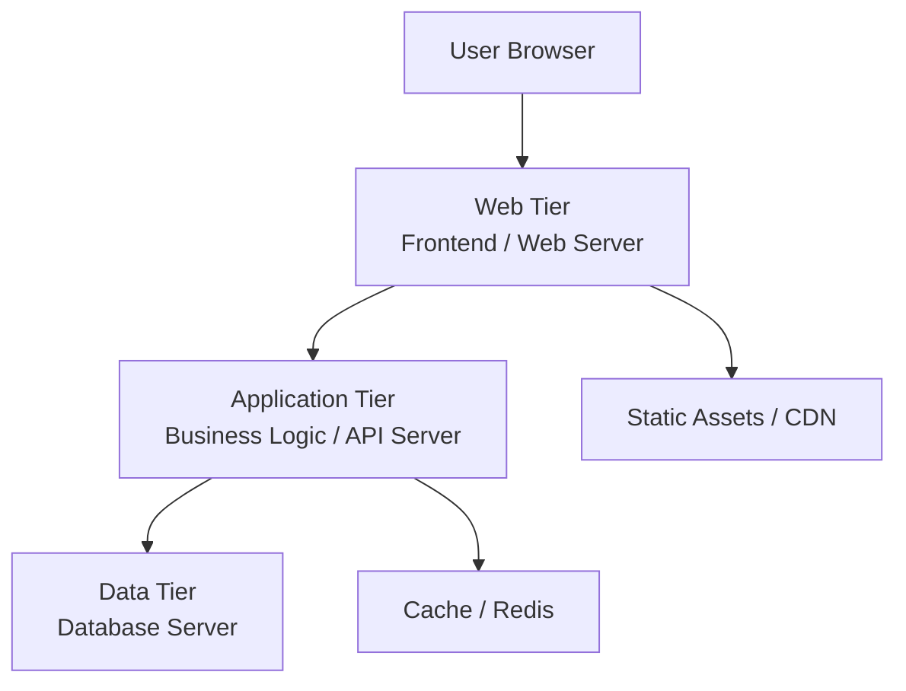

# Copilot Chat Conversation Export: 3-tier web application architecture diagram

**User:** @karthik-zippy
**Thread URL:** https://github.com/copilot/c/ae397c9d-b887-4a4b-be77-23bcc0128176

## @karthik-zippy

create a architecture digram for 3 tire webapp

## Copilot

Here’s a simple architecture diagram for a 3-tier web app:

Typical 3 tiers:
- Web tier: UI, web server, static content
- Application tier: backend logic, authentication, APIs
- Data tier: database, storage

If you want, I can also provide:
1. a professional AWS-style version,
2. a Kubernetes/microservices version, or
3. a diagram image in SVG/PNG-friendly Mermaid format.
